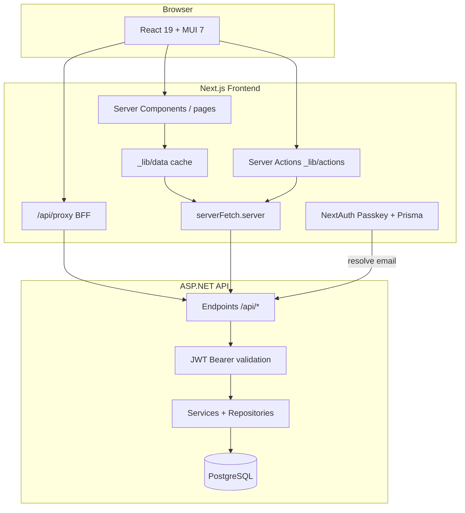

# E-Online Frontend Architecture

## Product intent

**Absolute Online (E-Online Business)** is an institution-scoped LMS for:

- **Trainees** — take courses, complete homework/assessments, annotate PDF textbooks, keep notes
- **Instructors** — manage classrooms, build homework modules (FormBuilder), grade submissions
- **Institution admins** — manage users, courses, subjects, academic levels
- **Platform owners** — manage institutions, billing, invoices, subscriptions

The frontend is a **Next.js 16 App Router** SPA-with-RSC hybrid. The backend is an **ASP.NET Core minimal API** (`E-Online-Backend-Business/E-Online-API`) on PostgreSQL.

---

## System diagram



---

## Frontend layer model

### 1. Routing (`src/app/`)

Next.js App Router. Route groups:

- **Public** — `/`, `/about`, `/signin`, `/signup`
- **Dashboard** — `/dashboard/*` wrapped by `dashboard/layout.tsx` (client shell: MathJax, date pickers, nav)
- **API routes** — `/api/auth/*`, `/api/proxy/*`

Each dashboard feature is a segment with optional `loading.tsx`, `error.tsx`, `page.tsx`, and `_components/`.

### 2. Dashboard shell

```
RootLayout (server, auth())
  └── Providers (Session, SWR, MUI theme, Alert)
        └── dashboard/layout.tsx (client)
              └── DashboardComponent
                    ├── SideMenu (desktop, md+)
                    ├── AppNavbar (mobile)
                    ├── Header (breadcrumbs, search — desktop)
                    ├── NavigationProgress
                    └── ChildrenContainer (scroll region)
                          └── {page content}
```

**Intent:** Fixed viewport shell; page content scrolls inside `ChildrenContainer`. Full-height pages (datagrids) use `dashboardPageRootSx`; growing content (card grids) uses `dashboardScrollablePageSx`.

### 3. Data layers

| Layer | Location | Runs on | Calls |
|-------|----------|---------|-------|
| Server reads | `_lib/data/*.ts` | Server only | `serverFetch.server` → backend direct |
| Server actions | `_lib/actions/*.ts` | Server (`'use server'`) | `serverFetch.server` |
| Client cache | `_lib/hooks/*.ts` | Client | SWR → Server Action as fetcher |
| Client proxy | `clientFetch.ts` | Client | `/api/proxy` → backend |
| BFF | `api/proxy/[...proxy]/route.ts` | Edge/server | Forwards with session Bearer token |

**RSC-first pattern (target state):**

```tsx
// page.tsx — Server Component
export default async function Page() {
  const data = await getFeatureData(); // _lib/data
  return <FeatureClient initialData={data} />;
}
```

Client island uses `initialData` directly; optional SWR with `fallbackData` for refresh.

### 4. Auth architecture

| Piece | Technology | Purpose |
|-------|------------|---------|
| User session | NextAuth v5 JWT | Passkey login, 15m session |
| User store (auth) | Prisma + PostgreSQL | WebAuthn credentials |
| API token | `jose` SignJWT HS256 | `session.apiAccessToken` for backend |
| Backend auth | ASP.NET JwtBearer | Same secret as `AUTH_SECRET` |

**Login sequence:**

1. Passkey WebAuthn via NextAuth
2. `GET /api/auth/resolve/{email}` loads user from backend DB
3. Frontend mints API JWT with `userId`, `role`, `institutionId`
4. All backend calls use `Authorization: Bearer {apiAccessToken}`

**RBAC:** Enforced in `src/proxy.ts` (Next.js 16 proxy convention) with per-route role allowlists. Menu hiding in `MenuContent`. Unauthenticated users redirect to `/signin` with `callbackUrl`.

### 5. Component architecture

**Feature components** — `src/app/dashboard/{feature}/_components/`  
**Shared UI** — `src/app/_lib/components/` (TipTap, PDF viewer, Excalidraw, homework widgets)  
**Cross-feature dashboard** — `src/app/dashboard/_components/` (shell, charts, skeletons)

Folder pattern documented in `docs/COMPONENT_STANDARDS.md` (MainGrid reference).

### 6. Key libraries

| Concern | Library |
|---------|---------|
| UI | MUI 7, DataGrid, Charts, Date Pickers |
| Forms | react-hook-form, zod, conform |
| Rich text | TipTap + mui-tiptap |
| PDF | react-pdf |
| Diagrams | Excalidraw |
| Math | better-react-mathjax |
| Client cache | SWR 2 |

---

## Backend integration

### API surface

ASP.NET **minimal APIs** in `Endpoints/*.cs` — no MVC controllers. All under `/api`.

### Request paths

**Server-side (preferred for reads/mutations):**
```
serverFetch.server('/classrooms/details')
  → GET {BASE_API_URL}/api/classrooms/details
  → Authorization: Bearer {session.apiAccessToken}
```

**Client-side (legacy / interactive):**
```
clientFetch('/classrooms/details')
  → GET /api/proxy/classrooms/details (cookie session)
  → proxy adds Bearer token
  → GET {BASE_API_URL}/api/classrooms/details
```

### Institution scoping

Backend `InstitutionContextMiddleware` reads `institutionId` from JWT. Platform owner uses cross-institution access. Frontend must include `institutionId` in signed API token (done in `auth.ts` JWT callback).

### DTO alignment

Frontend types in `src/app/_lib/interfaces/types.ts` mirror backend `Application/DTOs/`. When adding endpoints, update both sides.

### CORS

Backend allows `ALLOWED_ORIGINS` (default `http://localhost:3000`). Server-side `serverFetch` bypasses CORS; browser calls must use proxy.

---

## Environment variables

| Variable | Required | Used by |
|----------|----------|---------|
| `BASE_API_URL` | Yes | All API calls |
| `AUTH_SECRET` | Yes | NextAuth + API JWT signing (must match backend) |
| `DATABASE_URL` | Yes | Prisma (passkey storage) |
| `AUTH_URL` / `NEXTAUTH_URL` | Recommended | Auth callbacks, JWT issuer |
| `APP_AUDIENCE` | Optional | JWT audience (default `api`) |

Validated in `src/lib/env.ts`.

---

## Role mapping

| Frontend `UserRole` | Backend | Typical access |
|---------------------|---------|----------------|
| `PlatformAdmin` (-1) | PlatformOwner | Institutions, billing |
| `Admin` (0) | Admin | Management, manage-courses |
| `Trainee` (1) | Student | Courses, library |
| `Instructor` (2) | Teacher | Management, manage-courses, courses |

---

## Docs in repo

| File | Contents |
|------|----------|
| `docs/DATA_FETCHING_STANDARDS.md` | Fetch layers, server/client boundaries, verification |
| `docs/COMPONENT_STANDARDS.md` | Folder pattern, layout tokens, mobile flex |
| `.cursor/skills/e-online-frontend/` | Agent navigation skill (this tree) |
